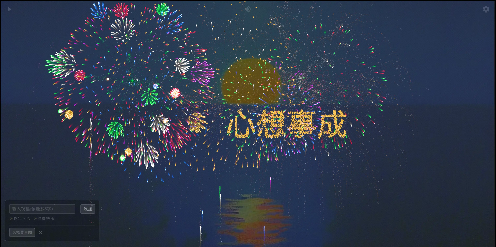

<div align="center">

# 烟花研究所

一个可以模拟研究各种烟花效果的 Web 应用((Cyber Fireworks Studio))

它可以展示各种绚丽多彩的烟花效果 并让人仿佛置身于真实（赛博）烟花的绚丽世界之中

```
🎆 祝大家新年快乐，蛇来运转，画蛇添福气！🐍
```



</div>

## 预览

- [https://alex2wong.github.io/Firework_Studio/](https://alex2wong.github.io/Firework_Studio/ "https://alex2wong.github.io/Firework_Studio/")

## 相比原版优化点

- 增加自定义`烟花文字`的输入和随机发射，可以`送烟花祝福语`了！

- 增加自定义`烟花夜空`的背景图，太棒了！可以看最喜欢的图片了！

## 许可证

`Copyright © 2022 NianBroken. All rights reserved.`

本项目采用 [Apache-2.0](https://www.apache.org/licenses/LICENSE-2.0 "Apache-2.0") 许可证。简而言之，你可以自由使用、修改和分享本项目的代码，但前提是在其衍生作品中必须保留原始许可证和版权信息，并且必须以相同的许可证发布所有修改过的代码。

## 特别感谢

- 📢 在禁放烟花爆竹的上海大部分地区，我们可以和家人朋友一起发射、欣赏赛博烟花啦！给 ta 送上烟花祝福

- [fork from: Firework Simulator](https://github.com/NianBroken/Firework_Simulator)

- [Firework Simulator v2](https://codepen.io/MillerTime/pen/XgpNwb)

- [haodong108/fireworks-2023](https://gitee.com/haodong108/fireworks-2023 "haodong108/fireworks-2023")

## 其他

欢迎提交 `Issues` 和 `Pull requests`
